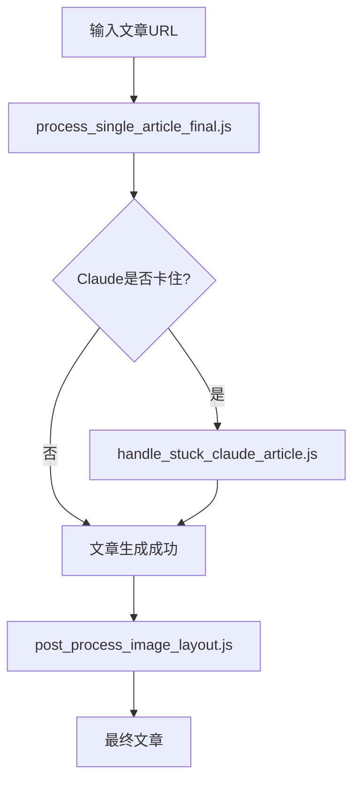

# 增强版工作流程指南

## 标准处理流程（保持原有封装不变）

### 1. 正常处理文章
```bash
node process_single_article_final.js <URL>
```

### 2. 检查图片布局（新增后处理步骤）
```bash
# 处理完成后，检查图片布局
node post_process_image_layout.js golf_content/2025-07-09/wechat_ready/wechat_article_XX.md
```

### 3. 如果Claude卡住
```bash
# 使用封装好的处理工具
node handle_stuck_claude_article.js <临时文件> <文章编号>
```

## 图片布局问题预防

### 问题特征
- 多张图片连续出现在文章开头
- 图片与相关内容距离太远
- 图片分布不均匀

### 解决方案

#### 方案1：自动后处理（推荐）
在现有流程后添加一步：
```bash
# 原有流程
node process_single_article_final.js <URL>

# 新增：检查并优化图片布局
node post_process_image_layout.js golf_content/2025-07-09/wechat_ready/wechat_article_04.md
```

#### 方案2：修改Claude提示词（需要修改claude_rewriter_fixed.js）
在提示词中加入：
```
图片处理规则：
- 不要把所有图片放在文章开头
- 将图片分散到相关段落中
- 每个主要段落最多一张图片
```

#### 方案3：手动调整
使用创建的修复脚本：
```bash
node fix_article_04_images.js
```

## 完整工作流程



## 关键原则

1. **不修改原有封装** - 所有优化都在外层进行
2. **可选的后处理** - 图片布局检查是可选步骤
3. **保持灵活性** - 可以手动调整或自动优化

## 常见问题处理

### Q: 如何判断需要优化图片布局？
A: 运行检查工具，它会告诉你是否有问题：
```bash
node post_process_image_layout.js <文章路径>
```

### Q: 能否自动化整个流程？
A: 可以创建一个包装脚本：
```bash
#!/bin/bash
# process_article_with_optimization.sh
node process_single_article_final.js "$1"
if [ $? -eq 0 ]; then
    # 获取最新文章编号并优化
    LATEST=$(ls golf_content/2025-07-09/wechat_ready/wechat_article_*.md | tail -1)
    node post_process_image_layout.js "$LATEST"
fi
```

### Q: 是否每篇文章都需要优化？
A: 不是。只有当图片布局有问题时才需要优化。工具会自动检测。